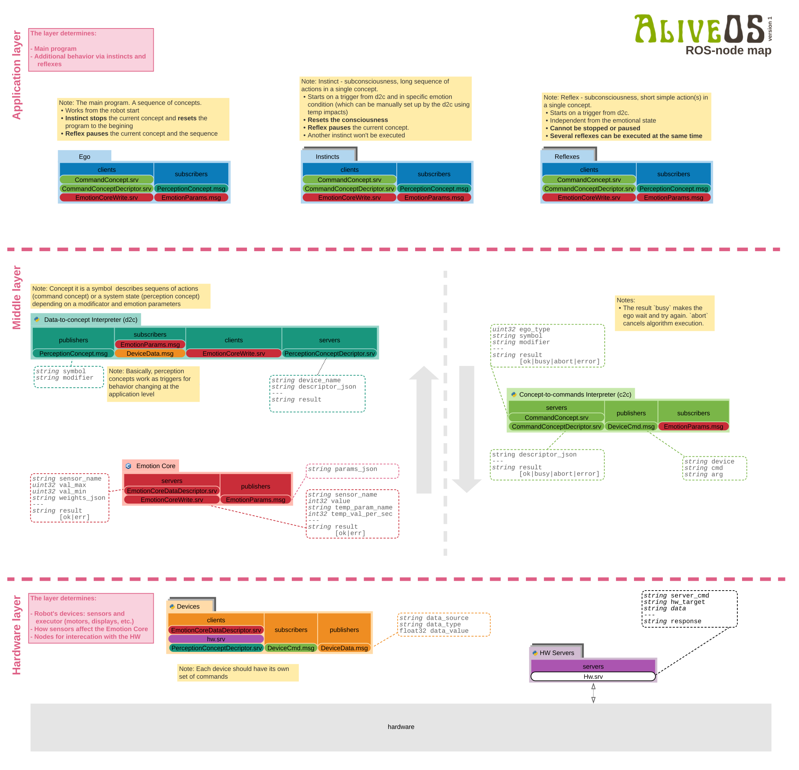

# AliveOS-ROS

Here is a ROS-based implementation of AliveOS. The OS implements structures of animal brains such as: reflexes, instincts, hormones, etc.

This is a metapackage for ROS Noetic

## Dependencies

- [Python 3](https://www.python.org/)
- [ROS Noetic](http://wiki.ros.org/noetic)

## ROS packages

The operating system consists of following packages:

- [aliveos_ros_meta](https://github.com/an-dr/aliveos_ros_meta)
- [aliveos_app](https://github.com/an-dr/aliveos_app)
- [aliveos_demo](https://github.com/an-dr/aliveos_demo)
- [aliveos_hw](https://github.com/an-dr/aliveos_hw)
- [aliveos_launch](https://github.com/an-dr/aliveos_launch)
- [aliveos_middle](https://github.com/an-dr/aliveos_middle)
- [aliveos_msgs](https://github.com/an-dr/aliveos_msgs)
- [aliveos_py](https://github.com/an-dr/aliveos_py)

## Installation

- Create a catkin workspace
- In the `src` directory of the workspace:
    - clone the repository `git clone https://github.com/an-dr/aliveos_ros_meta.git`
    - or add it as a submodule `git add submodule https://github.com/an-dr/aliveos_ros_meta.git`
- Execute the command bellow to download other packages of the AliveOS stack

```bash
vcs import --recursive --input ./aliveos_ros_meta/aliveos.rosinstall .
```

- (Optionally) add all packages to the `.gitignore` file:

```txt
# aliveos deps
src/aliveos_app
src/aliveos_demo
src/aliveos_hw
src/aliveos_launch
src/aliveos_middle
src/aliveos_msgs
src/aliveos_py
```

## Structure



## Support

You can support the project

[](https://paypal.me/4ndr/1eur)

Any amount will be highly appreciated.
